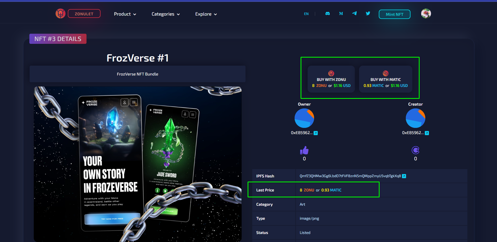

# Connect the world with Chainlink
## Web App Demo: https://matic.zonulet.io

## See how we use Chainlink PriceFeed
- [x] [Get Latest Matic and Pair Price](https://github.com/Agin-DropDisco/ETH-DENVER-2023/blob/2af9ccbf1113cc5df2aeffcce18ded897ae35c56/CHAINLINK/connect-the-world-with-chainlink/client/src/components/nft-detail/nft-detail.js#L300-L304)
- [x] [Compare NFT Price to USD, MATIC and ZONULET Token](https://github.com/Agin-DropDisco/ETH-DENVER-2023/blob/2af9ccbf1113cc5df2aeffcce18ded897ae35c56/CHAINLINK/connect-the-world-with-chainlink/client/src/components/nft-detail/nft-detail.js#L377-L379)
- [x] [Implement Chainlink Oracle to each NFT Price](https://github.com/Agin-DropDisco/ETH-DENVER-2023/blob/2af9ccbf1113cc5df2aeffcce18ded897ae35c56/CHAINLINK/connect-the-world-with-chainlink/client/src/components/nft-detail/nft-detail.js#L1034-L1040)
- [x] [Swap Price Agregate, Market Cap and Total Liquidity using Chainlink Oracle](https://github.com/Agin-DropDisco/ETH-DENVER-2023/blob/2af9ccbf1113cc5df2aeffcce18ded897ae35c56/CHAINLINK/connect-the-world-with-chainlink/client/src/components/landing/landing.js#L571-L585)

### When the nft price is updated, the matic/usd aggregator and also pairs from zonu/matic will be adjusted automatically.
**Prof:**

  

**Update Price From 8 ZONU to 15**

 

  

## Orcale Contract: [SOURCES](https://github.com/Agin-DropDisco/ETH-DENVER-2023/blob/main/CHAINLINK/connect-the-world-with-chainlink/truffle/contracts/ZonuletOracleV2.sol)

## Flow

  

