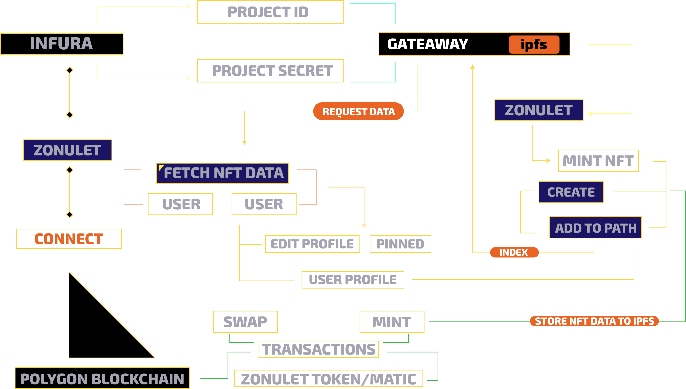

# Best Use of Ethereum Archive Data

## Web App Demo: https://matic.zonulet.io

## See how we use Ethereum Archive Data
- [x] [Spesify Block to get the Latest Minted of NFT](https://github.com/Agin-DropDisco/ETH-DENVER-2023/blob/a9084626968de3792c60ff5cb4e56b078b4e6806/INFURA/Best-Use-of-Ethereum-Archive-Data/client/src/components/nft-detail/nft-detail.js#L148)
- [x] [Spesify Block to get the Latest Buy NFTs](https://github.com/Agin-DropDisco/ETH-DENVER-2023/blob/a9084626968de3792c60ff5cb4e56b078b4e6806/INFURA/Best-Use-of-Ethereum-Archive-Data/client/src/components/explore/exploreall.js#L362)
- [x] [Spesify Block to get the latest who Gifted NFT](https://github.com/Agin-DropDisco/ETH-DENVER-2023/blob/a9084626968de3792c60ff5cb4e56b078b4e6806/INFURA/Best-Use-of-Ethereum-Archive-Data/client/src/components/explore/exploreall.js#LL368C62-L368C71)

- [x] [Create IPFS](https://github.com/Agin-DropDisco/ETH-DENVER-2023/blob/79da0f73a237a7620dc75569d3787da1a95540e7/INFURA/Best-Use-of-Infura-NFT-API/client/src/components/mint/mint.js#L762)
- [x] [Adding IPFS Data to Zonulet Path](https://github.com/Agin-DropDisco/ETH-DENVER-2023/blob/79da0f73a237a7620dc75569d3787da1a95540e7/INFURA/Best-Use-of-Infura-NFT-API/client/src/components/mint/mint.js#L834)
- [x] [Pinning NFT](https://github.com/Agin-DropDisco/ETH-DENVER-2023/blob/79da0f73a237a7620dc75569d3787da1a95540e7/INFURA/Best-Use-of-Infura-NFT-API/client/src/components/mint/mint.js#L853)
- [x] [Fetch NFT Data from Gateaway](https://github.com/Agin-DropDisco/ETH-DENVER-2023/blob/79da0f73a237a7620dc75569d3787da1a95540e7/INFURA/Best-Use-of-Infura-NFT-API/client/src/components/explore/exploreall.js#L778)

## Flow

  

