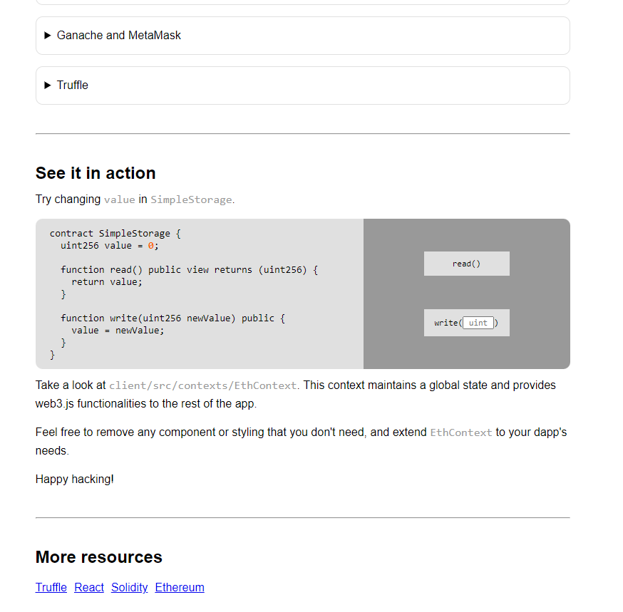

# Use the Truffle React Box to deploy a dapp on Infura
# React Truffle Box

This box comes with everything you need to start using Truffle to write, compile, test, and deploy smart contracts, and interact with them from a React app.

## Installation

First ensure you are in an empty directory.

Run the `unbox` command using 1 of 2 ways.

```sh
# Install Truffle globally and run `truffle unbox`
$ npm install -g truffle
$ truffle unbox react
```

```sh
# Alternatively, run `truffle unbox` via npx
$ npx truffle unbox react
```

Start the react dev server.

```sh
$ cd client
$ npm start
```
Add Mumbai ChainID on Truffle Config : Network

```sh
$ cd truffle
$ truffle migrate --network mumbai
```

Result 
```sh

Starting migrations...
======================
> Network name:    'mumbai'
> Network id:      80001
> Block gas limit: 20156620 (0x13390cc)


2_deploy_contracts.js
=====================
:: Deploying Base ZonuletNFT

   Deploying 'ZonuletNFT'
   ----------------------
   > transaction hash:    0x9060daaa8109949b26a154fe3c536341537a529c1d33965ff7d5f4a85bf4433c
   > Blocks: 4            Seconds: 8
   > contract address:    0x9e8749EA4E2574ef361f907DEed0B8076B88af92
   > block number:        32435101
   > block timestamp:     1677378949
   > account:             0xE8596204d3F66DF17452BdfA796b0e03C27E9DbA
   > balance:             1.511705724526956971
   > gas used:            3682149 (0x382f65)
   > gas price:           2.100000001 gwei
   > value sent:          0 ETH
   > total cost:          0.007732512903682149 ETH


:: Deploying ZonuletNFTSale

   Deploying 'ZonuletNFTSale'
   --------------------------
   > transaction hash:    0xb56fb1d9060ea0d1f8c3a556e7a8c245c5ea72e47f0f005c930e0483d39ead4b
   > Blocks: 4            Seconds: 9
   > contract address:    0x00e286f4C2543FB86C7b5e5B92c25ca1a68d7264
   > block number:        32435109
   > block timestamp:     1677378967
   > account:             0xE8596204d3F66DF17452BdfA796b0e03C27E9DbA
   > balance:             1.509256633125790737
   > gas used:            1166234 (0x11cb9a)
   > gas price:           2.100000001 gwei
   > value sent:          0 ETH
   > total cost:          0.002449091401166234 ETH


:: Deploying ZonuletNFTLikes

   Deploying 'ZonuletNFTLikes'
   ---------------------------
   > transaction hash:    0xf4d01513bf55d1dfc1050000980f90f1f022f8098b8aa5e369bb068a16f0e2da
   > Blocks: 3            Seconds: 4
   > contract address:    0x67f313574EC2BFFF35638Bc947a1a16421569A27
   > block number:        32435117
   > block timestamp:     1677378983
   > account:             0xE8596204d3F66DF17452BdfA796b0e03C27E9DbA
   > balance:             1.507250022224835208
   > gas used:            955529 (0xe9489)
   > gas price:           2.100000001 gwei
   > value sent:          0 ETH
   > total cost:          0.002006610900955529 ETH


:: Deploying ZonuletAvatars

   Deploying 'ZonuletAvatars'
   --------------------------
   > transaction hash:    0x6ef6a7ca94f353417379dec37020147c8d506a5a11f5b947a8b6b99e213340fb
   > Blocks: 0            Seconds: 4
   > contract address:    0x89Aa5F69969E28eda9463DC8d8d2eBbdDEb54A47
   > block number:        32435122
   > block timestamp:     1677378995
   > account:             0xE8596204d3F66DF17452BdfA796b0e03C27E9DbA
   > balance:             1.504912434523722071
   > gas used:            1113137 (0x10fc31)
   > gas price:           2.100000001 gwei
   > value sent:          0 ETH
   > total cost:          0.002337587701113137 ETH


:: Deploying ZonuletVerified

   Deploying 'ZonuletVerified'
   ---------------------------
   > transaction hash:    0x39739cdabb1d6cc60d10c252369a2e6e09b4497269e83e29d87f24dd75734366
   > Blocks: 1            Seconds: 4
   > contract address:    0xa35Fd9ccd66B058852b4542021668037baFadD2B
   > block number:        32435131
   > block timestamp:     1677379013
   > account:             0xE8596204d3F66DF17452BdfA796b0e03C27E9DbA
   > balance:             1.504128962323348989
   > gas used:            373082 (0x5b15a)
   > gas price:           2.100000001 gwei
   > value sent:          0 ETH
   > total cost:          0.000783472200373082 ETH


:: Deploying ZonuletBlacklist

   Deploying 'ZonuletBlacklist'
   ----------------------------
   > transaction hash:    0x936291b2fd330fd949196eb9af1d103e90ffc96f7fad8566bbf7c574904e3e74
   > Blocks: 6            Seconds: 12
   > contract address:    0x7FB021CC13fd4CB818bEF9AF842f3B38Aa1B90a1
   > block number:        32435139
   > block timestamp:     1677379031
   > account:             0xE8596204d3F66DF17452BdfA796b0e03C27E9DbA
   > balance:             1.503072175122845757
   > gas used:            503232 (0x7adc0)
   > gas price:           2.100000001 gwei
   > value sent:          0 ETH
   > total cost:          0.001056787200503232 ETH


:: Deploying ZonuletZDEX

   Deploying 'ZonuletZDEX'
   -----------------------
   > transaction hash:    0x5a49604667ffa1a8c6fb4cf7c0989c44e48f7e3c81e092940a6c6bfc484caec2
   > Blocks: 2            Seconds: 4
   > contract address:    0x365a43AEb0DA37EF50F2091f1C03d6EEE05929a3
   > block number:        32435146
   > block timestamp:     1677379045
   > account:             0xE8596204d3F66DF17452BdfA796b0e03C27E9DbA
   > balance:             1.501014240221865788
   > gas used:            979969 (0xef401)
   > gas price:           2.100000001 gwei
   > value sent:          0 ETH
   > total cost:          0.002057934900979969 ETH

=====================Finished============================
 NFT Base:  0x9e8749EA4E2574ef361f907DEed0B8076B88af92
 NFT Likes: 0x67f313574EC2BFFF35638Bc947a1a16421569A27
 NFT Sale:  0x00e286f4C2543FB86C7b5e5B92c25ca1a68d7264
 Avatars:   0x89Aa5F69969E28eda9463DC8d8d2eBbdDEb54A47
 Verified:  0xa35Fd9ccd66B058852b4542021668037baFadD2B
 Blacklist: 0x7FB021CC13fd4CB818bEF9AF842f3B38Aa1B90a1
 ZDEX:      0x365a43AEb0DA37EF50F2091f1C03d6EEE05929a3
==========================================================
   > Saving migration to chain.
   > Saving artifacts
   -------------------------------------
   > Total cost:     0.018423997208773332 ETH

Summary
=======
> Total deployments:   7
> Final cost:          0.018423997208773332 ETH
```

Frontend Result
<p align="center">

</p>

From there, follow the instructions on the hosted React app. It will walk you through using Truffle and Ganache to deploy the `SimpleStorage` contract, making calls to it, and sending transactions to change the contract's state.

## FAQ

- __How do I use this with Ganache (or any other network)?__

  The Truffle project is set to deploy to Ganache by default. If you'd like to change this, it's as easy as modifying the Truffle config file! Check out [our documentation on adding network configurations](https://trufflesuite.com/docs/truffle/reference/configuration/#networks). From there, you can run `truffle migrate` pointed to another network, restart the React dev server, and see the change take place.

- __Where can I find more resources?__

  This Box is a sweet combo of [Truffle](https://trufflesuite.com) and [Webpack](https://webpack.js.org). Either one would be a great place to start!
