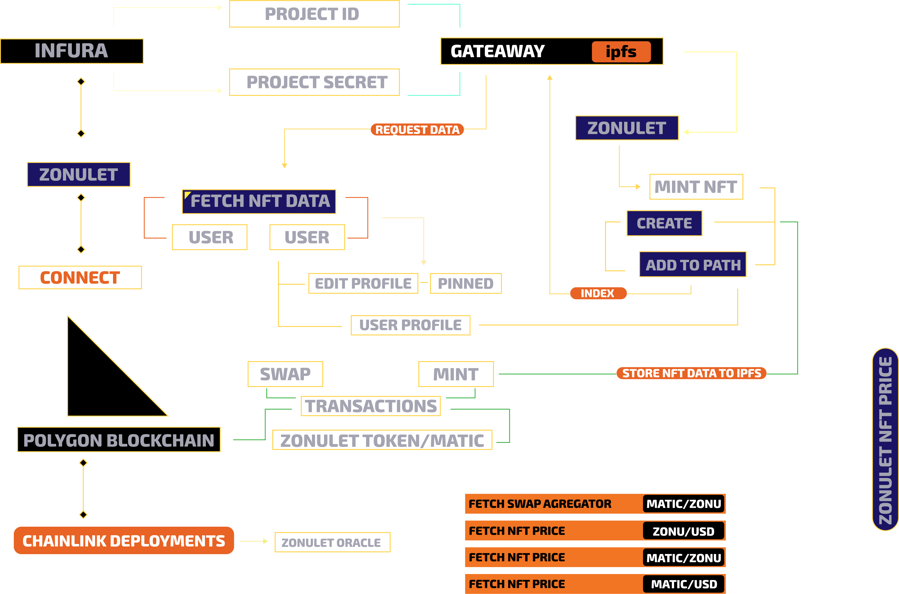

# Best Use of Polygon
## Web App Demo: https://matic.zonulet.io

## See how we implement polygon into our dapp [ Using Chainlink Price Feed and Infura ]
- [x] [Get Latest Matic and Pair Price](https://github.com/Agin-DropDisco/ETH-DENVER-2023/blob/2af9ccbf1113cc5df2aeffcce18ded897ae35c56/CHAINLINK/connect-the-world-with-chainlink/client/src/components/nft-detail/nft-detail.js#L300-L304)
- [x] [Compare NFT Price to USD, MATIC and ZONULET Token](https://github.com/Agin-DropDisco/ETH-DENVER-2023/blob/2af9ccbf1113cc5df2aeffcce18ded897ae35c56/CHAINLINK/connect-the-world-with-chainlink/client/src/components/nft-detail/nft-detail.js#L377-L379)
- [x] [Implement Chainlink Oracle to each NFT Price](https://github.com/Agin-DropDisco/ETH-DENVER-2023/blob/2af9ccbf1113cc5df2aeffcce18ded897ae35c56/CHAINLINK/connect-the-world-with-chainlink/client/src/components/nft-detail/nft-detail.js#L1034-L1040)
- [x] [Swap Price Agregate, Market Cap and Total Liquidity using Chainlink Oracle](https://github.com/Agin-DropDisco/ETH-DENVER-2023/blob/2af9ccbf1113cc5df2aeffcce18ded897ae35c56/CHAINLINK/connect-the-world-with-chainlink/client/src/components/landing/landing.js#L571-L585)
- [x] [Spesify Block to fetch NFT Minting Teansaction](https://github.com/Agin-DropDisco/ETH-DENVER-HACK-2023/blob/29ca9258bf23ed3437f3e14d1c30a081aaaac890/POLYGON/Best-Use-of-Polygon/client/src/components/explore/exploreall.js#L362-L370)
- [x] [Fetch Latest Minted NFT](https://github.com/Agin-DropDisco/ETH-DENVER-HACK-2023/blob/29ca9258bf23ed3437f3e14d1c30a081aaaac890/POLYGON/Best-Use-of-Polygon/client/src/components/explore/exploreall.js#L442-L473)
- [x] [Compare NFT Price with agregator <Matic-USD> <Matic-ZONU[Zonulet] <ZONU-USD>](https://github.com/Agin-DropDisco/ETH-DENVER-HACK-2023/blob/29ca9258bf23ed3437f3e14d1c30a081aaaac890/POLYGON/Best-Use-of-Polygon/client/src/components/nft-detail/nft-detail.js#L296-L304)
- [x] [Implement NFT Price with agregator](https://github.com/Agin-DropDisco/ETH-DENVER-HACK-2023/blob/29ca9258bf23ed3437f3e14d1c30a081aaaac890/POLYGON/Best-Use-of-Polygon/client/src/components/nft-detail/nft-detail.js#L1004-L1040)
- [x] [Mint NFT](https://github.com/Agin-DropDisco/ETH-DENVER-2023/blob/79da0f73a237a7620dc75569d3787da1a95540e7/INFURA/Best-Use-of-Infura-NFT-API/client/src/components/mint/mint.js#L754)
- [x] [Create IPFS](https://github.com/Agin-DropDisco/ETH-DENVER-2023/blob/79da0f73a237a7620dc75569d3787da1a95540e7/INFURA/Best-Use-of-Infura-NFT-API/client/src/components/mint/mint.js#L762)
- [x] [Adding IPFS Data to Zonulet Path](https://github.com/Agin-DropDisco/ETH-DENVER-2023/blob/79da0f73a237a7620dc75569d3787da1a95540e7/INFURA/Best-Use-of-Infura-NFT-API/client/src/components/mint/mint.js#L834)
- [x] [Pinning NFT](https://github.com/Agin-DropDisco/ETH-DENVER-2023/blob/79da0f73a237a7620dc75569d3787da1a95540e7/INFURA/Best-Use-of-Infura-NFT-API/client/src/components/mint/mint.js#L853)
- [x] [Fetch NFT Data from Gateaway](https://github.com/Agin-DropDisco/ETH-DENVER-2023/blob/79da0f73a237a7620dc75569d3787da1a95540e7/INFURA/Best-Use-of-Infura-NFT-API/client/src/components/explore/exploreall.js#L778)
  
  ## Workflow
  

    
    
  

  
  # How to Mint NFT, Buy/Sell and Gifted NFT: https://youtu.be/lKaNJh5QnmE

  
  ## Contracts Address
  - [x] [DexSwapZonu](https://mumbai.polygonscan.com/address/0xb054102df5c8b66d8b7f58344964f86e9e2d3e00)
  - [x] [ZonuletNFT](https://mumbai.polygonscan.com/address/0xF136607Ed9766507c2D99EbB2Abf0d7C773e3f2f)
  - [x] [ZonuletNFTLikes](https://mumbai.polygonscan.com/address/0x3444064BA645B8a061DCD47c28C0Fd3c506eb13B) 
  - [x] [ZonuletNFTSale](https://mumbai.polygonscan.com/address/0xaF27687753694b9944c0AD08A800683C6FE7bEec)  
  - [x] [ZonuletAvatars](https://mumbai.polygonscan.com/address/0x40D6Ed2986Ce7748Ab2F272f4AAa082Fee7F199F)    
  - [x] [ZonuletVerified](https://mumbai.polygonscan.com/address/0x4d2CEc6be0D0e69f56b1B7E4DEe17585549CB9F1)   
  - [x] [ZonuletBlacklist](https://mumbai.polygonscan.com/address/0x57b6eF1d9b57271De7430c8d5d36fc26941094D0)   
  - [x] [Zonulet:](https://mumbai.polygonscan.com/address/0x216eD590Cb7Ec3417CAb82699ae493522fECf580)    
